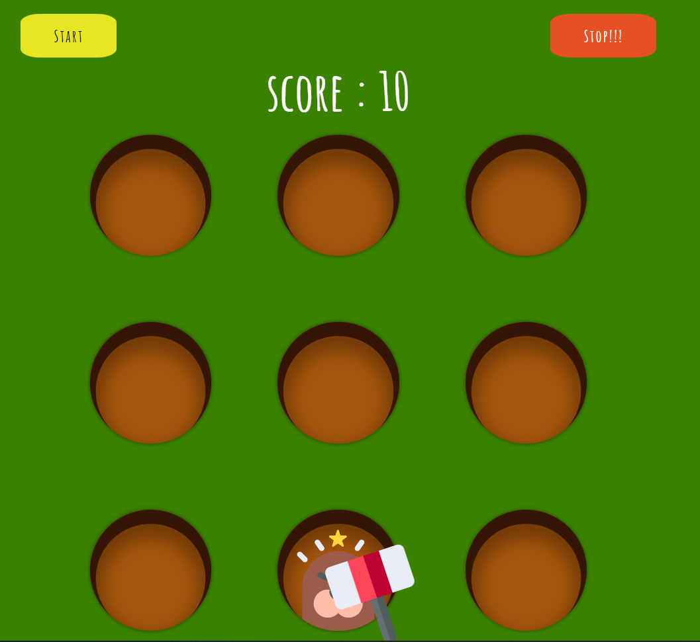
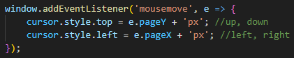
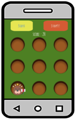

 
  

<h1 align="center"> Tradicional-wack-a-mole </h1>

:heart_eyes: <h2>Hello everyone, my name is <strong> Raquel </strong> and it is a pleasure for me that you are reading this. </h2>
  

---

  

 
  

  

---

<h2 id="table-of-contents"> :book: Table of Contents</h2>

  
Table of Contents

  <ul>
    <li><a href="#about-the-project"> ➤ Wack a What???</a></li>
    <li><a href="#learnt"> ➤ What I have learnt</a></li>
    <li><a href="#make-it-yours"> ➤ What you need to make it yours</a></li>
    <li><a href="#responsive"> ➤ I am responsive</a></li>
    <li><a href="#who"> ➤ Who is Raquel </a></li>
  </ul>

<h2 id="about-the-project"> :eyes: Wack a What???</h2>

 
The game was created in the 70s by  [Bob Cassata](https://www.bobsspaceracers.com/about/index)  and today thanks to this [tutorial](https://www.youtube.com/watch?v=b20YueeXwZg&ab_channel=AngleBrace) and a little bit of my imagination, I can present you my version.

<h2 id="learnt"> :floppy_disk: What I have learnt

n</h2>

 
<ul>
<li>(Mousemove event)[https://developer.mozilla.org/en-US/docs/Web/API/Element/mousemove_event]</li>
<li>(How to set audios in Javascript)[https://developer.mozilla.org/en-US/docs/Web/API/HTMLAudioElement/Audio]</li>
<li>Use addEventListener window</li>
 
 
</ul>

<h2 id="make-it-yours"> :open_hands: What you need to make it yours</h2>

 
It is made with HTML, Css and Javascript so you don't need anything special. You can play directly by clicking on the (link)[https://rpg87.github.io/Tradicional-wack-a-mole/], you can fork the project or you can download the entire game. It is up to you.

<h2 id="responsive"> :iphone: I am responsive</h2>

You can play from any device you choose

 
<h4>This is how it would look playing on your cell phone </h4>

<h2 id="who"> :raising_hand: Who is Raquel</h2>

 I am Raquel, I consider myself a person with a great sense of humor, always eager to learn, a lover of challenges and this combination is what led me to study web development. 
If you want to know more about me or if you have a fun project and you need help we could work together, you can find me (here)[https://www.linkedin.com/in/raquel-pe-go/]
